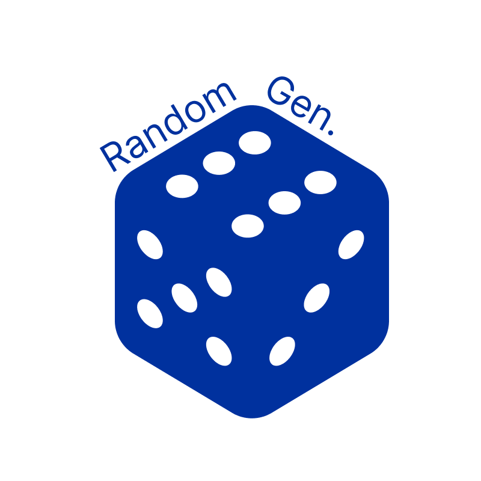
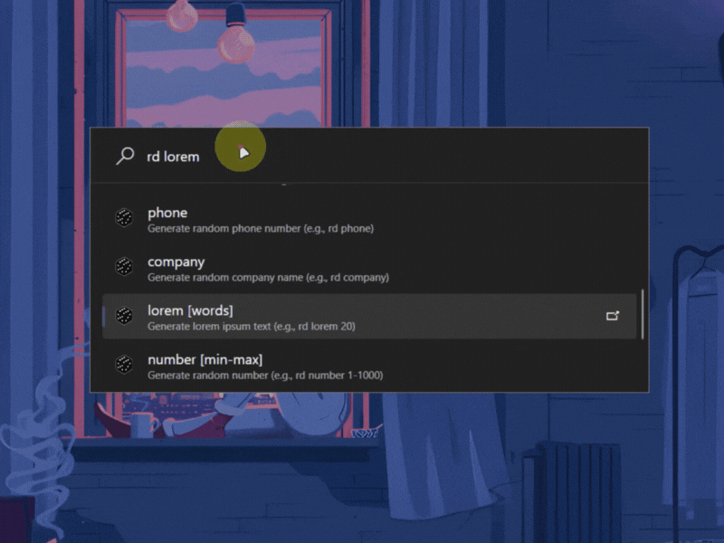
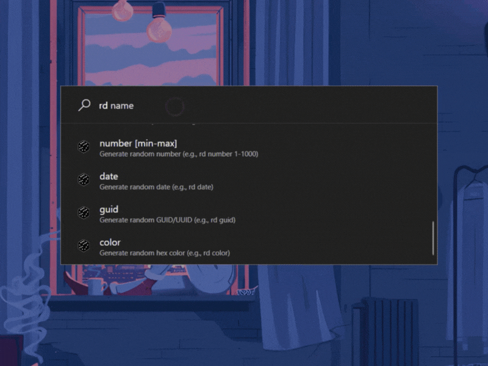
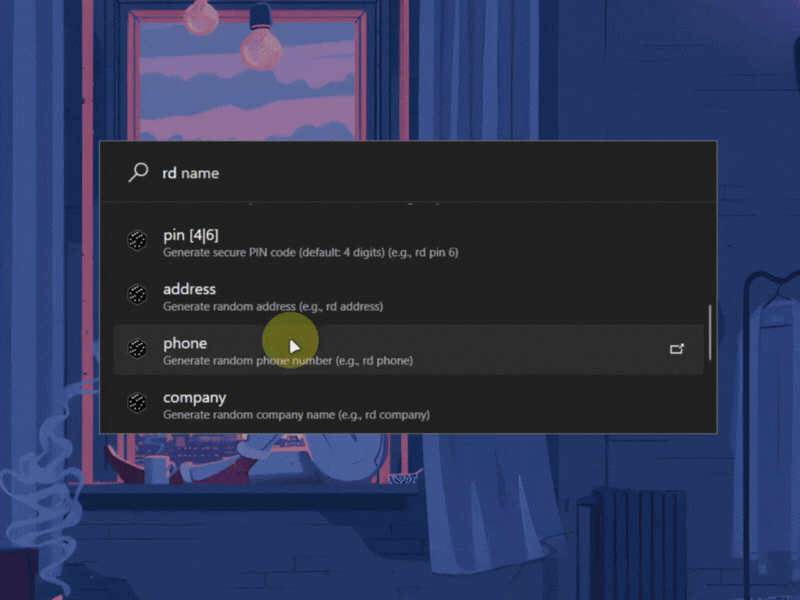
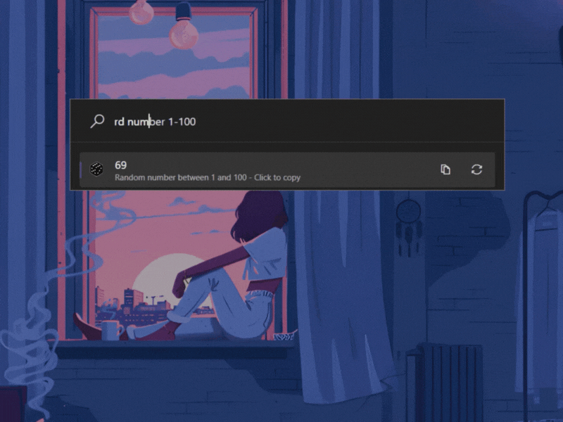

<div align="center">
  
  <h1>🎲 RandomGen for PowerToys Run  🎲</h1>
  <h3>Generate random data instantly with a single keystroke. Cool features like smart PIN generation, secure password creation, and more.</h3>

  <!-- Badges -->
  <div style="margin: 20px 0;">
    <a href="https://github.com/ruslanlap/PowerToysRun-RandomGen/releases/latest">
      
    </a>
    <a href="https://github.com/ruslanlap/PowerToysRun-RandomGen/actions/workflows/build-and-release.yml">
      
    </a>
    <a href="https://github.com/ruslanlap/PowerToysRun-RandomGen/releases">
      
    </a>
    <a href="https://github.com/ruslanlap/PowerToysRun-RandomGen/blob/master/LICENSE">
      
    </a>
  </div>

  <div>
    
    
    
    
    
    
    
    
    
    
    
    
    <a href="https://github.com/ruslanlap/PowerToysRun-RandomGen/stargazers">
      
    </a>
    <a href="https://github.com/ruslanlap/PowerToysRun-RandomGen/issues">
      
    </a>
    
    
    
    <a href="https://twitter.com/intent/tweet?text=Check%20out%20this%20awesome%20PowerToys%20Run%20Random%20Data%20Generator%20plugin!&url=https://github.com/ruslanlap/PowerToysRun-RandomGen">
      
    </a>
  </div>

  <div style="margin: 20px 0;">
    <a href="https://github.com/ruslanlap/PowerToysRun-RandomGen/releases/latest/download/RandomGen-1.0.1-x64.zip">
      
    </a>
    <a href="https://github.com/ruslanlap/PowerToysRun-RandomGen/releases/latest/download/RandomGen-1.0.1-arm64.zip">
      
    </a>
    <a href="https://github.com/ruslanlap/PowerToysRun-RandomGen/releases">
      
    </a>
  </div>
</div>

## 📊 Download Statistics

<div align="center">
  
  
</div>

## 🎥 Demo

<div align="center">
  <!-- Main Overview Demo -->
  <div style="margin-bottom: 25px;">
    <p><strong>Overview of RandomGen commands</strong></p>
    
  </div>
  
  <!-- Password and PIN demos -->
  <div style="display: flex; justify-content: space-between; margin-bottom: 25px;">
    <div style="width: 48%;">
      <p><strong>Command: <code>rd password 16</code></strong></p>
      <p>Generate a secure 16-character password</p>
      
    </div>
    <div style="width: 48%;">
      <p><strong>Commands: <code>rd pin 6</code> and <code>rd color</code></strong></p>
      <p>Generate a 6-digit PIN and random hex color</p>
      
    </div>
  </div>
  
  <!-- Address/Date and GUID demos -->
  <div style="display: flex; justify-content: space-between; margin-bottom: 25px;">
    <div style="width: 48%;">
      <p><strong>Commands: <code>rd address</code> and <code>rd date</code></strong></p>
      <p>Generate a random address and date</p>
      
    </div>
    <div style="width: 48%;">
      <p><strong>Command: <code>rd guid</code></strong></p>
      <p>Generate a random GUID/UUID</p>
      
    </div>
  </div>
  
  <!-- Name and Number demos -->
  <div style="display: flex; justify-content: space-between;">
    <div style="width: 48%;">
      <p><strong>Command: <code>rd name</code></strong></p>
      <p>Generate a random person name</p>
      
    </div>
    <div style="width: 48%;">
      <p><strong>Command: <code>rd number 1-1000</code></strong></p>
      <p>Generate a random number between 1 and 1000</p>
      
    </div>
  </div>
</div>

## 📋 Table of Contents

- [✨ Features](#-features)
- [🚀 Quick Start](#-quick-start)
- [🔍 Usage](#-usage)
- [⚙️ Installation](#️-installation)
- [🧩 Requirements](#-requirements)
- [🛠️ Building from Source](#️-building-from-source)
- [🤝 Contributing](#-contributing)
- [📄 License](#-license)
- [🙏 Acknowledgements](#-acknowledgements)
- [💬 Feedback and Support](#-feedback-and-support)
- [❓ FAQ](#-faq)
- [🔒 Security Note](#-security-note)

## ✨ Features

RandomGen is a powerful PowerToys Run plugin that generates various types of random data with a single keystroke. Perfect for developers, testers, and anyone who needs quick access to random data.

### Key Features

- 🔐 **Cryptographically Secure Passwords** - Generate strong passwords with mixed case, numbers, and symbols
- 📍 **Secure PIN Codes** - Create numeric PINs with smart pattern detection to avoid weak PINs like 1234 or 0000
- 👤 **Personal Data** - Generate realistic names, emails, phone numbers, and addresses
- 🏢 **Business Data** - Company names and other business-related information
- 📅 **Date Generation** - Random dates within customizable ranges
- 🔢 **Number Generation** - Random numbers with custom min-max ranges
- 🆔 **Unique Identifiers** - GUIDs/UUIDs for development and testing
- 🎨 **Color Codes** - Random HEX colors for design and testing
- 🌐 **Web Data** - URLs and domains for testing
- 💳 **Payment Testing** - Credit card numbers (fake, for testing only)
- 📝 **Lorem Ipsum** - Placeholder text with customizable word count

### Technical Highlights

- **Plugin ID:** `EFADBA167C1B41D8A7426A7DF808D28E`
- **Action Keyword:** `rd`
- **Thread-Safe Design** - Optimized for performance with thread-local Faker instances
- **Smart Caching** - Improved performance with intelligent result caching
- **Cryptographically Secure** - Uses `System.Security.Cryptography.RandomNumberGenerator` for secure random generation
- **Intelligent Suggestions** - Smart autocomplete for commands
- **Context Menu Support** - Right-click options for copying and regenerating values

## 🚀 Quick Start

1. **Download** the latest release for your architecture ([x64](https://github.com/ruslanlap/PowerToysRun-RandomGen/releases/download/v1.0.2/RandomGen-1.0.2-x64.zip) or [ARM64](https://github.com/ruslanlap/PowerToysRun-RandomGen/releases/download/v1.0.2/RandomGen-1.0.2-arm64.zip))
2. **Extract** the ZIP file to your PowerToys Run plugins directory:
   ```
   %LOCALAPPDATA%\Microsoft\PowerToys\PowerToys Run\Plugins\RandomGen\
   ```
3. **Restart PowerToys**
4. Press `Alt+Space` to open PowerToys Run
5. Type `rd` followed by what you want to generate (e.g., `rd password`)
6. Best practice: Press the Space button to regenerate a new value.

## 🔍 Usage

### Basic Commands

Use the activation keyword `rd` followed by the data type you want to generate:

| Command | Example | Description |
|---------|---------|-------------|
| `rd password [length]` | `rd password 16` | Generate a secure password (default: 12 chars) |
| `rd pwd [length]` | `rd pwd 16` | Alias for password command |
| `rd pin [length]` | `rd pin 6` | Generate a numeric PIN (default: 4 digits) |
| `rd email` | `rd email` | Generate a random email address |
| `rd name` | `rd name` | Generate a random full name |
| `rd address` | `rd address` | Generate a random address |
| `rd phone` | `rd phone` | Generate a random phone number |
| `rd company` | `rd company` | Generate a random company name |
| `rd lorem [count]` | `rd lorem 25` | Generate lorem ipsum text (default: 10 words) |
| `rd number [min-max]` | `rd number 1-1000` | Generate a random number (default: 1-100) |
| `rd num [min-max]` | `rd num 1-1000` | Alias for number command |
| `rd date` | `rd date` | Generate a random date |
| `rd guid` | `rd guid` | Generate a random GUID/UUID |
| `rd uuid` | `rd uuid` | Alias for guid command |
| `rd color` | `rd color` | Generate a random hex color |
| `rd url` | `rd url` | Generate a random URL |
| `rd creditcard` | `rd creditcard` | Generate a random credit card number (test use only) |
| `rd credit` | `rd credit` | Alias for creditcard command |

### Examples

```bash
# Generate a 16-character password
rd password 16

# Generate a 6-digit PIN
rd pin 6

# Generate a random email address
rd email

# Generate a random number between 1 and 1000
rd number 1-1000

# Generate 25 words of lorem ipsum text
rd lorem 25
```

## ☕ Support
Enjoying RandomGen? ☕ Buy me a coffee to support development:

[](https://ruslanlap.github.io/ruslanlap_buymeacoffe/)

### Advanced Features

- **Context Menu** - Right-click on any result to:
  - Copy to clipboard (Ctrl+C)
  - Generate a new value (F5)

- **Smart Autocomplete** - Type part of a command to see suggestions

- **Intelligent Caching** - Recently generated values are cached for improved performance

## ⚙️ Installation

### Prerequisites
- [PowerToys](https://github.com/microsoft/PowerToys) (v0.75 or later)
- Windows 10/11 (x64 or ARM64)
- .NET 9.0 Runtime (included with PowerToys)
- Approximately 2MB of disk space

### Installation Steps

#### Method 1: Using the Release Package
1. Download the latest release for your architecture ([x64](https://github.com/ruslanlap/PowerToysRun-RandomGen/releases/download/v1.0.2/RandomGen-1.0.2-x64.zip) or [ARM64](https://github.com/ruslanlap/PowerToysRun-RandomGen/releases/download/v1.0.2/RandomGen-1.0.2-arm64.zip))
2. Extract the ZIP file to your PowerToys Run plugins directory:
   ```
   %LOCALAPPDATA%\Microsoft\PowerToys\PowerToys Run\Plugins\RandomGen\
   ```
3. Restart PowerToys
4. Enable the plugin in PowerToys Settings → PowerToys Run → Plugin Manager

#### Method 2: Manual Installation from Build
1. Build the project (see [Building from Source](#️-building-from-source))
2. Copy all files from the `RandomGen\Publish\` folder to your PowerToys Run plugins directory:
   ```
   %LOCALAPPDATA%\Microsoft\PowerToys\PowerToys Run\Plugins\RandomGen\
   ```
3. Restart PowerToys
4. Enable the plugin in PowerToys Settings → PowerToys Run → Plugin Manager

### Verifying Installation
After installation, press `Alt+Space` to open PowerToys Run, then type `rd` to see if the plugin is working correctly.

## 🧩 Requirements

- Windows 10/11 (x64 or ARM64)
- PowerToys v0.75 or later
- .NET 9.0 Runtime (included with PowerToys)
- Approximately 2MB of disk space

## 🛠️ Building from Source

### PTRUN Compliance

This plugin is fully compliant with PowerToys Run validation requirements:

- ✅ **PTRUN1301**: Package naming follows the `<name>-<version>-<platform>.zip` convention
- ✅ **PTRUN1303**: SHA256 checksums are generated for all packages
- ✅ **PTRUN1401**: Plugin version in metadata matches filename version
- ✅ **PTRUN1402**: No unnecessary PowerToys dependencies included

The GitHub Actions workflow automatically ensures compliance with these requirements.

### Prerequisites
- [.NET 9.0 SDK](https://dotnet.microsoft.com/download/dotnet/9.0)
- [PowerToys](https://github.com/microsoft/PowerToys) (for testing)
- [Visual Studio 2022](https://visualstudio.microsoft.com/) or [Visual Studio Code](https://code.visualstudio.com/)
- [Git](https://git-scm.com/)

### Build Steps

```bash
# Clone the repository
git clone https://github.com/ruslanlap/RandomGen.git
cd RandomGen

# Restore dependencies
dotnet restore

# Build the solution
dotnet build -c Release

# Create a publishable version (optional)
dotnet publish -c Release -o ./Publish
```

The built plugin will be in `RandomGen\bin\Release\net9.0-windows10.0.22621.0` or in the `Publish` directory if you ran the publish command.

### Project Structure

- `RandomGen/Community.PowerToys.Run.Plugin.RandomGen/` - Main plugin code
  - `Main.cs` - Core plugin implementation
  - `Images/` - Plugin icons
  - `plugin.json` - Plugin metadata
- `RandomGen/Community.PowerToys.Run.Plugin.RandomGen.UnitTests/` - Unit tests

### Dependencies

- [Bogus](https://github.com/bchavez/Bogus) v35.6.3 - For generating realistic fake data
- [Community.PowerToys.Run.Plugin.Dependencies](https://www.nuget.org/packages/Community.PowerToys.Run.Plugin.Dependencies/) v0.91.0 - PowerToys Run plugin dependencies

## 🤝 Contributing

Contributions are welcome! Here's how you can help:

1. Fork the repository
2. Create a feature branch (`git checkout -b feature/AmazingFeature`)
3. Commit your changes (`git commit -m 'Add some AmazingFeature'`)
4. Push to the branch (`git push origin feature/AmazingFeature`)
5. Open a Pull Request

### Ideas for Contribution

- **New Data Types** - Add more types of random data generation
- **Localization** - Add support for more languages and region-specific data formats
- **Settings UI** - Create a settings page for customizing default values
- **Performance Optimizations** - Improve caching and thread safety
- **Enhanced Validation** - Add more validation for generated data
- **Unit Tests** - Expand test coverage
- **Documentation** - Improve inline code documentation and user guides

### Development Guidelines

- Follow the existing code style and patterns
- Ensure all new features have appropriate unit tests
- Use thread-safe practices for all data generation
- Document any new commands or features
- Test on both x64 and ARM64 architectures if possible

## 📄 License

This project is licensed under the MIT License - see the [LICENSE](LICENSE) file for details.

## 💬 Feedback and Support

If you encounter any issues or have suggestions for improvement, please [open an issue](https://github.com/ruslanlap/PowerToysRun-RandomGen/issues) on GitHub.

## ❓ FAQ

<details>
<summary><b>How do I change the default action keyword?</b></summary>
<p>You can change the action keyword in PowerToys Settings → PowerToys Run → Plugin Manager → RandomGen → Action Keyword.</p>
</details>

<details>
<summary><b>Are the generated passwords secure?</b></summary>
<p>Yes, passwords are generated using cryptographically secure random number generation methods from the .NET framework, ensuring high entropy and unpredictability.</p>
</details>

<details>
<summary><b>Can I use this data in production?</b></summary>
<p>The generated data is intended for testing, development, and demonstration purposes only. While passwords are cryptographically secure, other data like names, addresses, and credit card numbers are fictional.</p>
</details>

<details>
<summary><b>Does this plugin work offline?</b></summary>
<p>Yes, RandomGen works completely offline and doesn't require an internet connection.</p>
</details>

<details>
<summary><b>How can I add a new data type?</b></summary>
<p>To add a new data type, you would need to modify the Main.cs file, add a new generator method, and update the command handling logic. See the Contributing section for more details.</p>
</details>

## 🔒 Security Note

- **Secure Password Generation** - Passwords are generated using `System.Security.Cryptography.RandomNumberGenerator` for cryptographically secure randomness
- **PIN Security** - PINs are checked against common patterns (like 1234, 0000) to avoid weak PINs
- **Fake Data Only** - All generated data (names, addresses, credit cards, etc.) is completely fictional and suitable for testing only
- **Privacy** - No personal data is collected, stored, or transmitted by this plugin
- **Local Processing** - All data generation happens locally on your machine

> ⚠️ **Note:** While passwords generated by this tool use cryptographically secure methods, always follow your organization's security policies for production passwords.

## 🙏 Acknowledgements

- [Bogus](https://github.com/bchavez/Bogus) - For generating realistic fake data
- [Microsoft PowerToys](https://github.com/microsoft/PowerToys) - For the amazing PowerToys Run platform
- [All Contributors](https://github.com/ruslanlap/PowerToysRun-RandomGen/graphs/contributors) - For their valuable contributions
- Credit card numbers are fake and generated using standard test patterns
- Do not use generated personal information for malicious purposes